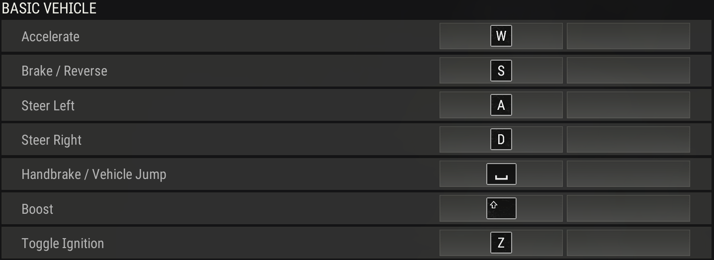
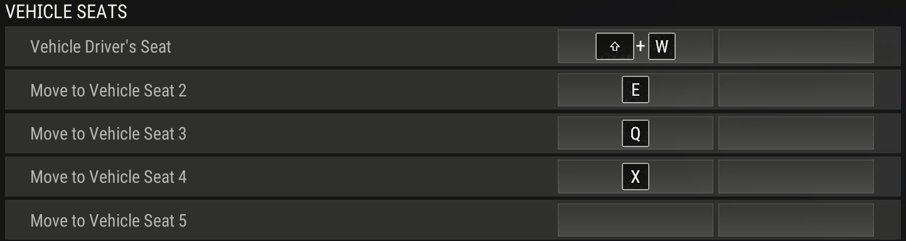
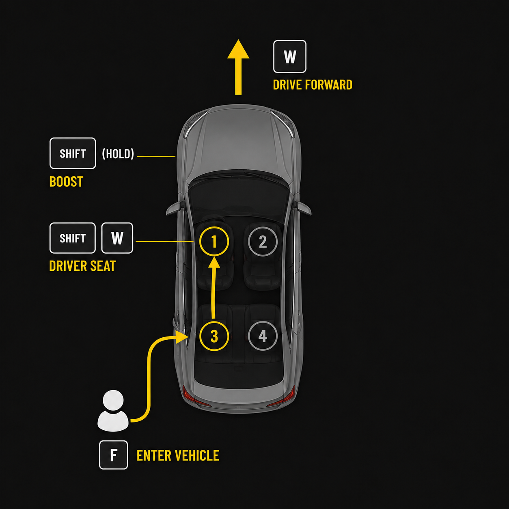
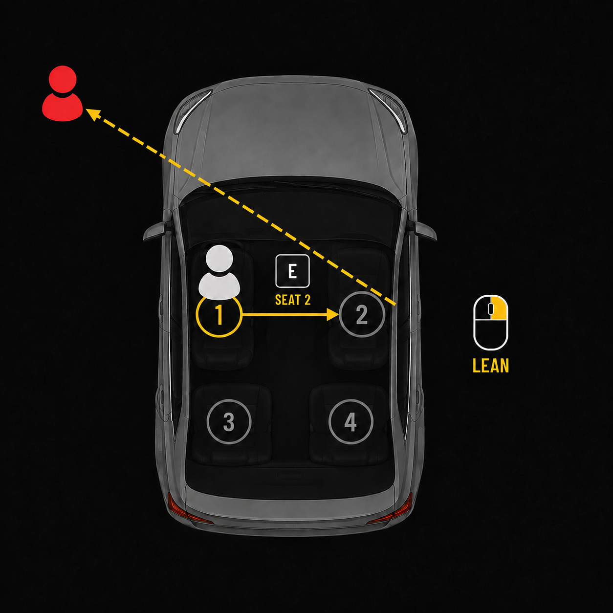
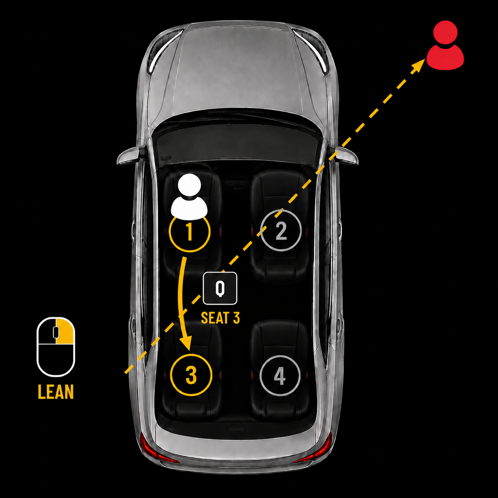
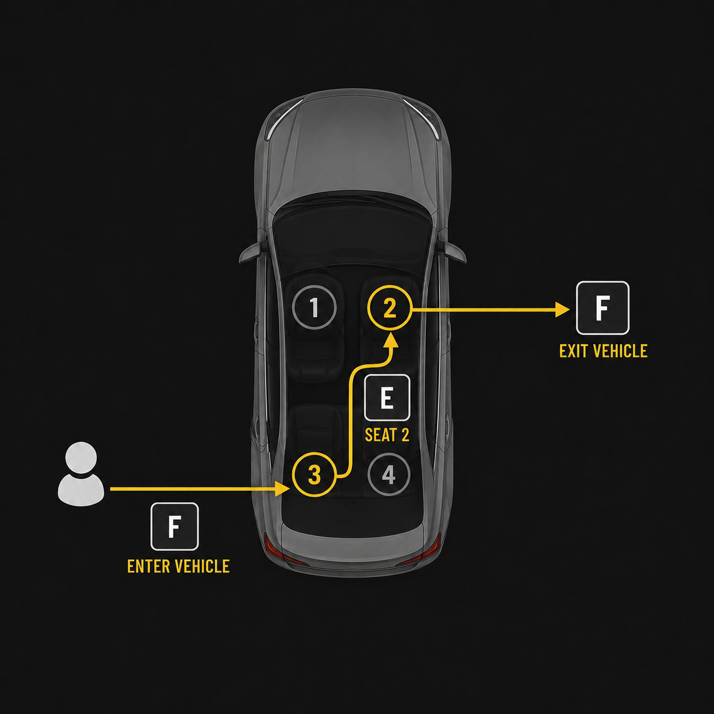

# Vehicles

 

With **Driver Seat** bound to **{Shift}{W}** you can instantly boost drive from any position in the vehicle.  

---

  
  

 

Binding **Seat 2** to **{E}** and **Seat 3** to **{Q}** enables easy access to both sides of the vehicle for drive-by shooting.  

Leaning from side opposite to the enemy significantly reduces the exposed hitbox.

---

This can also be used to instantly get on the other side of a parked vehicle for cover.

# Pinging

 

Binding **Radio Message Wheel** to **(Mouse 5)** and **Delete Marker**  to **(Mouse 4)** enables the use of thumb to mark/unmark without impairing movement or shooting.